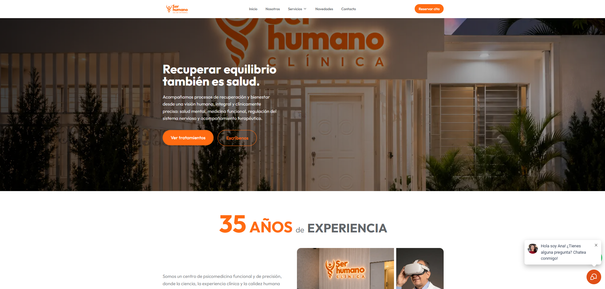
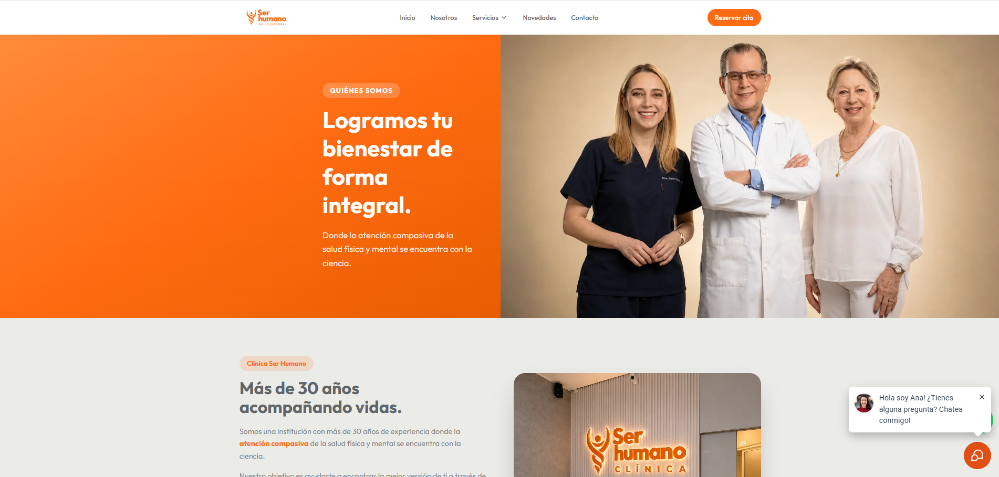
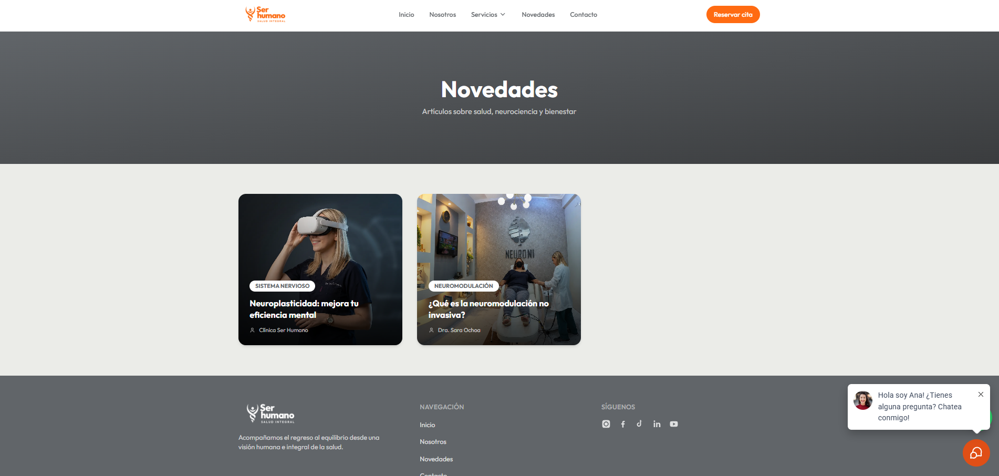
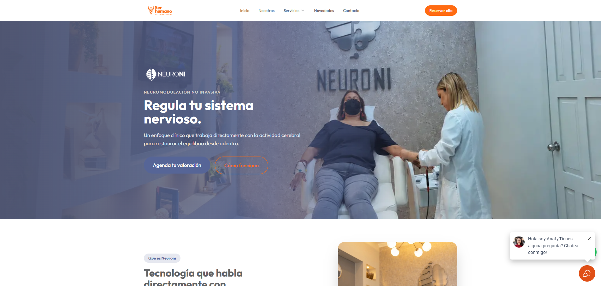
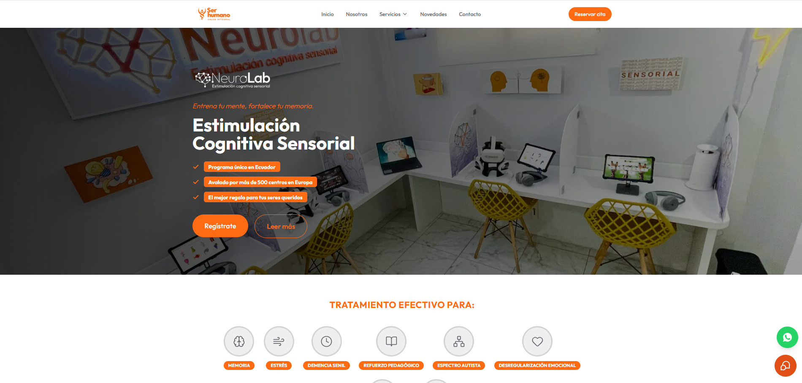
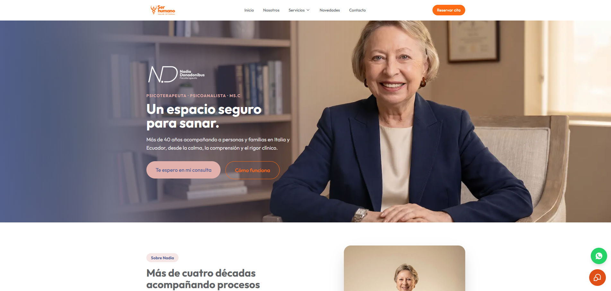
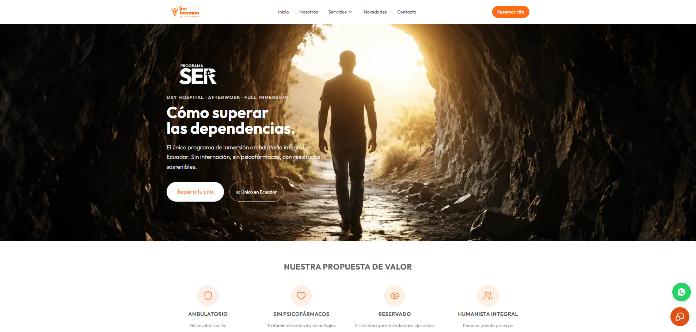

# Clínica Ser Humano Salud Integral — Sitio Web Oficial

Sitio web institucional de **Clínica Ser Humano Salud Integral**, desarrollado con Next.js 14 App Router, Tailwind CSS v3 y Framer Motion. Incluye páginas de servicios, blog con artículos médicos, carrusel de testimonios, formulario de contacto con SMTP, datos estructurados JSON-LD y analíticas con GTM + GA4.

**Producción:** [clinicaserhumano.ec](https://clinicaserhumano.ec)  
**Stack:** Next.js 14 · TypeScript · Tailwind CSS v3 · Framer Motion · Nodemailer  
**Analíticas:** Google Tag Manager (`GTM-PVFCTMQ6`) + Google Analytics 4 (`G-MCYWCPF760`)

---

## Tabla de contenidos

- [Vista previa](#vista-previa)
- [Tecnologías](#tecnologías)
- [Estructura del proyecto](#estructura-del-proyecto)
- [Páginas y rutas](#páginas-y-rutas)
- [Implementaciones clave](#implementaciones-clave)
- [APIs y servicios externos](#apis-y-servicios-externos)
- [Variables de entorno](#variables-de-entorno)
- [Instalación y desarrollo](#instalación-y-desarrollo)
- [Despliegue en Vercel](#despliegue-en-vercel)
- [SEO y datos estructurados](#seo-y-datos-estructurados)
- [Pendiente / Roadmap](#pendiente--roadmap)

---

## Vista previa

### Inicio


### Nosotros


### Novedades — Blog


### Neuroni — Neuromodulación


### NeuroLab


### Dra. Nadia Donadonibus


### Programa SER


---

## Tecnologías

### Framework y lenguaje

| Tecnología | Versión | Uso |
|------------|---------|-----|
| [Next.js](https://nextjs.org/) | 14.2.x | Framework principal, App Router, Server Components |
| [TypeScript](https://www.typescriptlang.org/) | ^5 | Tipado estático en todo el proyecto |
| [React](https://react.dev/) | ^18 | Componentes de UI |

### Estilos y animaciones

| Tecnología | Versión | Uso |
|------------|---------|-----|
| [Tailwind CSS](https://tailwindcss.com/) | ^3.4 | Sistema de diseño utilitario con tokens de marca |
| [Framer Motion](https://www.framer.com/motion/) | ^12 | Carrusel de testimonios con AnimatePresence |
| [Lucide React](https://lucide.dev/) | ^1.22 | Iconografía consistente |

### Backend / Servicios

| Tecnología | Versión | Uso |
|------------|---------|-----|
| [Nodemailer](https://nodemailer.com/) | ^9 | Envío de correos desde el formulario de contacto |
| Next.js API Routes | — | Endpoint `/api/contact` para el formulario |

### Analíticas y marketing

| Servicio | ID | Uso |
|----------|----|-----|
| Google Tag Manager | `GTM-PVFCTMQ6` | Contenedor de etiquetas para toda la analítica |
| Google Analytics 4 | `G-MCYWCPF760` | Métricas de tráfico, comportamiento y conversiones |

### Tipografía

- **Outfit** (Google Fonts, pesos 300–700) — fuente principal del sitio
- Cargada vía `next/font/google` con subsetting automático

---

## Estructura del proyecto

```
PaginaWebClinica/
├── public/
│   ├── fotos/          # Imágenes del equipo y servicios
│   ├── logos/          # Logos de submarcas y universidades
│   ├── team/           # Fotos de los profesionales
│   ├── testimonios/    # Fotos de pacientes con testimonios
│   ├── nadia/          # Imágenes de la Dra. Nadia
│   ├── neurolab/       # Imágenes de NeuroLab
│   ├── programaser/    # Imágenes del Programa SER
│   ├── manifest.json   # PWA manifest
│   ├── robots.txt      # Generado por next/robots
│   └── sitemap.xml     # Generado por next/sitemap
│
├── src/
│   ├── app/
│   │   ├── layout.tsx              # Layout raíz: fuente, GTM, navbar, footer
│   │   ├── page.tsx                # Página de inicio
│   │   ├── not-found.tsx           # Página 404 personalizada
│   │   ├── sitemap.ts              # Generador de sitemap
│   │   ├── robots.ts               # Generador de robots.txt
│   │   ├── nosotros/page.tsx       # Página "Quiénes somos"
│   │   ├── novedades/
│   │   │   ├── page.tsx            # Listado del blog
│   │   │   └── [slug]/page.tsx     # Artículo individual (ruta dinámica)
│   │   ├── servicios/
│   │   │   ├── neuromodulacion/page.tsx   # Neuroni
│   │   │   ├── neurolab/page.tsx          # NeuroLab
│   │   │   ├── nadia-donadonibus/page.tsx # Dra. Nadia
│   │   │   └── programa-ser/page.tsx      # Programa SER
│   │   └── api/
│   │       └── contact/route.ts    # API: envío de correo SMTP
│   │
│   ├── components/
│   │   ├── layout/
│   │   │   ├── Navbar.tsx          # Navegación con dropdown de servicios
│   │   │   ├── Footer.tsx          # Footer con redes sociales y links
│   │   │   └── WhatsAppButton.tsx  # Botón flotante de WhatsApp
│   │   ├── sections/
│   │   │   └── ContactSection.tsx  # Formulario + mapa integrado
│   │   ├── ui/
│   │   │   ├── Button.tsx          # Componente Button reutilizable
│   │   │   └── VideoCarousel.tsx   # Carrusel de videos de YouTube
│   │   ├── blog/
│   │   │   ├── CommentForm.tsx     # Formulario de comentarios del blog
│   │   │   └── ShareButtons.tsx    # Botones para compartir artículos
│   │   └── seo/
│   │       └── JsonLd.tsx          # Inyector de JSON-LD para datos estructurados
│   │
│   └── lib/
│       ├── blog.ts       # Base de datos en memoria de artículos del blog
│       ├── constants.ts  # Constantes globales: teléfono, WhatsApp, redes, equipo
│       ├── schemas.ts    # Esquemas JSON-LD (MedicalClinic, Article, Physician…)
│       └── seo.ts        # Helper buildMeta() y BASE_URL
```

---

## Páginas y rutas

| Ruta | Tipo | Descripción |
|------|------|-------------|
| `/` | Static | Página de inicio |
| `/nosotros` | Static | Historia y equipo |
| `/novedades` | Static | Listado de artículos del blog |
| `/novedades/[slug]` | Dynamic | Artículo individual del blog |
| `/servicios/neuromodulacion` | Static | Servicio Neuroni |
| `/servicios/neurolab` | Static | Servicio NeuroLab |
| `/servicios/nadia-donadonibus` | Static | Dra. Nadia Donadonibus |
| `/servicios/programa-ser` | Static | Programa SER Libre |
| `/api/contact` | API Route | Envío de formulario de contacto |
| `/sitemap.xml` | Auto-generated | Sitemap para buscadores |
| `/robots.txt` | Auto-generated | Directivas para crawlers |

---

## Implementaciones clave

### Blog dinámico

El blog está implementado como una base de datos en memoria en `src/lib/blog.ts`. Cada artículo define:

```typescript
{
  slug: string;        // URL: /novedades/[slug]
  title: string;
  author: string;
  date: string;        // Formato: "julio 08, 2026"
  category: string;
  image: string;       // Ruta en /public
  tags: string[];
  content: string;     // HTML completo del artículo
}
```

La ruta dinámica `[slug]/page.tsx` genera `generateMetadata` con Open Graph, Twitter Cards y JSON-LD de tipo `Article`.

**Artículos actuales:**
- *¿Qué pasa en el cerebro cuando vivimos bajo estrés crónico?* — Dra. Sara Ochoa
- *¿Qué es la neuromodulación no invasiva?* — Dra. Sara Ochoa *(incluye video de YouTube)*

---

### Formulario de contacto con SMTP

El endpoint `POST /api/contact` recibe `nombre`, `telefono` y `mensaje`, valida que los campos no estén vacíos y envía un correo HTML usando **Nodemailer** con autenticación Gmail (App Password).

El correo incluye:
- Header naranja con identidad visual de la clínica
- Tabla con los datos del contacto
- Botón CTA para responder directamente por WhatsApp

La respuesta al cliente es **inmediata** (`200 OK`) — el envío del correo ocurre en segundo plano con `.catch()` para no bloquear al usuario.

**Variables necesarias:** `SMTP_USER` y `SMTP_PASS` (ver sección de variables de entorno).

---

### Carrusel de testimonios

Componente `TestimoniosCarrusel` en `src/app/page.tsx` con comportamiento dual según breakpoint:

- **Móvil:** 1 testimonio por vez, 5 dots de navegación, avance automático cada 4 segundos
- **Desktop:** 3 testimonios por grupo, 2 grupos, animación de slide con `AnimatePresence` de Framer Motion

---

### Botón flotante de WhatsApp

`WhatsAppButton.tsx` genera URLs pre-cargadas con mensajes contextuales según la página. Los mensajes se centralizan en `WHATSAPP_MESSAGES` en `constants.ts` para evitar duplicación.

---

### Navbar con submarcas

La barra de navegación incluye un dropdown en escritorio y menú mobile que lista los 4 servicios (submarcas) con sus logos. Las submarcas se definen en el array `SUBMARCAS` de `constants.ts`.

---

### Carrusel de videos (home)

`VideoCarousel.tsx` muestra videos de YouTube embebidos en grupos de 3. Los IDs se definen en `VIDEO_SLIDES` de `constants.ts`.

---

## APIs y servicios externos

| Servicio | Tipo | Uso |
|----------|------|-----|
| **Gmail SMTP** | Nodemailer + App Password | Envío de correos del formulario de contacto |
| **Google Maps Embed** | iframe | Mapa de ubicación en la sección de contacto |
| **YouTube Embed** | iframe | Videos en el carrusel del home y artículos del blog |
| **WhatsApp API** | `wa.me` links | Botón flotante y CTAs de servicios |
| **Google Tag Manager** | Script `<head>` | Contenedor de analíticas y marketing |
| **Google Analytics 4** | Via GTM | Métricas de sesiones, usuarios y eventos |

---

## Variables de entorno

Crear un archivo `.env.local` en la raíz del proyecto con las siguientes variables:

```env
# Correo desde el que se envían los formularios (Gmail)
SMTP_USER=recepcion@serhumano.org

# App Password de Gmail (no es la contraseña normal de Google)
# Generarla en: Google Account > Seguridad > Contraseñas de aplicación
SMTP_PASS=xxxx_xxxx_xxxx_xxxx
```

> **Importante:** `.env.local` está en `.gitignore` y nunca debe subirse al repositorio. En Vercel, estas variables se configuran en el panel de **Settings > Environment Variables**.

---

## Instalación y desarrollo

### Requisitos previos

- Node.js v20+
- npm v10+

### Pasos

```bash
# 1. Clonar el repositorio
git clone https://github.com/clinicaserhumano/pagina-web-clinica-ser-humano.git
cd pagina-web-clinica-ser-humano

# 2. Instalar dependencias
npm install

# 3. Crear variables de entorno
# Copiar el ejemplo y editar con las credenciales reales
cp .env.example .env.local

# 4. Levantar el servidor de desarrollo
npm run dev
```

La aplicación estará disponible en `http://localhost:3000`.

> **Windows:** Si PowerShell bloquea la ejecución de scripts, ejecutar primero:  
> `Set-ExecutionPolicy -ExecutionPolicy RemoteSigned -Scope CurrentUser`

### Scripts disponibles

| Comando | Descripción |
|---------|-------------|
| `npm run dev` | Servidor de desarrollo con hot reload |
| `npm run build` | Compilación para producción |
| `npm start` | Servidor de producción (requiere `build` previo) |
| `npm run lint` | Verificación de calidad de código |

---

## Despliegue en Vercel

1. Conectar el repositorio de GitHub a [Vercel](https://vercel.com)
2. Configurar las variables de entorno en el panel de Vercel:
   - `SMTP_USER`
   - `SMTP_PASS`
3. El framework se detecta automáticamente como **Next.js**
4. Configurar el dominio `clinicaserhumano.ec` apuntando a los nameservers de Vercel

> El sitio actual está alojado en un servidor WordPress. Para migrar, actualizar los registros DNS en el panel del registrador de dominio una vez que el deploy de Vercel esté listo y probado en el dominio de preview.

---

## SEO y datos estructurados

### buildMeta()

Helper centralizado en `src/lib/seo.ts` que genera `Metadata` de Next.js con Open Graph y Twitter Cards. Todas las páginas lo usan:

```typescript
export const metadata = buildMeta({
  title: "Título de la página",
  description: "Descripción para buscadores.",
  path: "/ruta-de-la-pagina",
  image: `${BASE_URL}/imagen-og.png`, // opcional
});
```

### JSON-LD

Esquemas implementados en `src/lib/schemas.ts` e inyectados con el componente `<JsonLd />`:

| Esquema | Página |
|---------|--------|
| `MedicalClinic` | Inicio, Nosotros |
| `WebSite` | Layout raíz |
| `MedicalWebPage` | Páginas de servicios |
| `Physician` | Páginas de especialistas |
| `Article` | Artículos del blog |

### Sitemap y robots

Generados automáticamente por Next.js:
- `src/app/sitemap.ts` — lista todas las rutas estáticas y dinámicas (blog)
- `src/app/robots.ts` — permite indexación de `/` y bloquea `/api/`

---

## Pendiente / Roadmap

- [ ] **Política de privacidad** — Página `/politica-de-privacidad` requerida legalmente por tener formularios activos y GTM
- [ ] **Página de servicios** — `/servicios` devuelve 404; crear índice de servicios
- [ ] **Más artículos del blog** — Se recomiendan 4–5 artículos para el lanzamiento (actualmente hay 2)
- [ ] **`generateStaticParams` en el blog** — Para pre-renderizar artículos en build time
- [ ] **Security headers** — Agregar `Content-Security-Policy`, `X-Frame-Options` y otros headers en `next.config.mjs`
- [ ] **manifest.json** — Actualizar `"name": "App"` al nombre real de la clínica
- [ ] **Migración de dominio** — Migrar de WordPress a Vercel actualizando registros DNS
- [ ] **Capturas de pantalla** — Agregar imágenes reales en `/docs/screenshots/` para este README

---

## Créditos

Desarrollado por [Jorge Andres](https://github.com/jorgeandresur18) para **Clínica Ser Humano Salud Integral**, Guayaquil, Ecuador.

© 2026 Clínica Ser Humano Salud Integral. Todos los derechos reservados.
